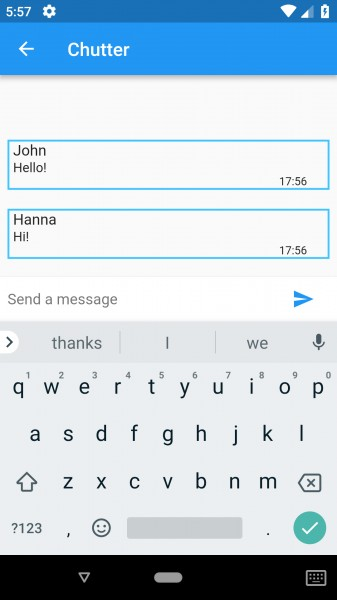

# Chutter
Chat-like mobile application built with Dart and Flutter

I did this project to try and learn Flutter and Dart because it looked cool and interesting

Requirements:
1. flutter and dart SDK downloaded https://flutter.io/get-started/install/
2. android/ios emulator or phone connected

To run:
1. Change both Config.json files in lib/Server and in assets to fit your needs
2. Server: go to lib/Server and run "dart main.dart", Client: run "flutter run"

